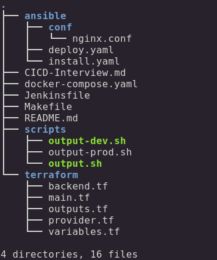

# CICD With Jenkins, Terraform and Ansible
---
### Contained in this document, is an in-depth explanation of the Repository Structure, and some of the processes required to setup the CICD pipeline. 
### The CICD pipeline structure makes use of **Jenkins** for automating builds, **Terraform** for provisioning infrastructure and lastly, **Ansible** for configuring the infrastructure set up by **Terraform**. 

---

## **Repository Structure**
---
- ### The image below showcases the file structure of this repository. 

    

- The `ansible` folder contains another folder called `conf` which contains a configuration file for **NGINX**. The configuration file simply routes traffic from the port `8000` to the HTTP port `80`. 

     Also contained in the `ansible` folder are two playbooks. `install.yaml` simply installs the necessary dependencies and libraries for the application to run, and `deploy.yaml` installs **NGINX** on the infrastructue and finally deploys the application configured in `docker-compose.yaml`, on to the infrastructure.

- `docker-compose.yaml` contains the configuration for a CMS(Content Management System), **WordPress**. Once `docker-compose.yaml`.
- `Jenkinsfile` contains the steps needed to build and deploy the **WordPress** application to two seperate environments; `Dev` environment and `Prod` environment. 
- `Makefile` contains shell commands for setting up the infrastructure with Terraform. 
- The `scripts` folder contains 3 shell scripts; `output-dev.sh`, `output-prod.sh` and `output.sh`. These shell scripts output the public IPv4 addresses of the `Dev` and `Prod` environments that have been set up by **Terraform**. The IP addresses are then added as part of the
`inventory` in **Ansible**, so **Ansible** can SSH into the servers and apply the playbooks on `Dev` and `Prod` respectively.
- The `terraform` folder contains 5 files; `backend.tf`,` main.tf`, ` outputs.tf`, ` provider.tf` and ` variables.tf`.

     `backend.tf` contains configurations for storing Terraform state on an object server, GCS (Google Cloud Storage).
     `main.tf` contains the configurations for the infrastructure that would be deployed in the pipeline. `outputs.tf` simply stores the IP addresses of the provisioned servers. This file will then be used by the shell scripts in the `scripts` folder. `provider.tf` contains configurations for the provider or otherwise called `terraform plugin` that would set up infrastructure in GCP (Google Cloud Platform). `variables.tf` contains variables that would be called and used in `main.tf`.
---
## **CICD Setup**
---
### **Jenkins:**
In order for Jenkins to properly perform the builds and run the CICD pipeline properly these plugins are required and need to be installed:
- `Basic Branch Build Strategies Plugin` - This plugin is required so builds can be triggered in Jenkins based on **regular commits** or **tagged commits**.
- `Git Plugin` - This plugin integrates Git with Jenkins.
- `SSH Credentials Plugin` - This plugin allows for Jenkins to SSH into the Bitbucket repository. 
### **Ansible:**
In order for Ansible to function properly and to configure the provisioned servers, an SSH **Private and Public key** are required. The SSH Public key is added in `Metadata > SSH Keys` in GCP. While the Private key is passed as `ansible_private_key_file` in the console. With the **Private key** provided, ansible can easily SSH into the servers and perform the necessary configurations.  
## **Terraform:**
In order for the terraform commands to work properly and to provision resources, terraform needs to be installed. 